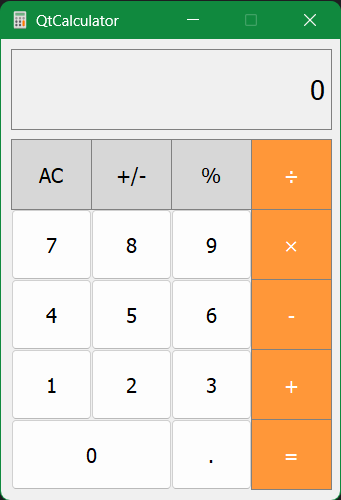

# **QtCalculator Application**

I am the developer of the "QtCalculator" application, a calculator tool built using the [Qt framework](https://www.qt.io). Below are some key aspects of the development process:


## **Features**

- **Basic Operations:** QtCalculator supports fundamental arithmetic operations such as addition, subtraction, multiplication, and division.

- **User-Friendly Interface:** QtCalculator has a pleasant and intuitive user interface.


## **Interface**




## Build Instructions

Follow these steps to build and run QtCalculator on your system:

1. **Clone the Repository:**
   ```bash
    git clone https://github.com/PashaKryvulets/QtCalculator
    cd QtCalculator
   ```

2. **Build the Project**
   ```bash
    mkdir build
    cd build
    qmake ..
    make
   ```

3. **Run the Calculator**
   ```bash
    ./QtCalculator
   ```


## **Usage**
Enter numbers and use the on-screen buttons to perform calculations.


## **Requirements**
Make sure you have [QtCreator](https://www.qt.io/download) and [C++ compiler](https://isocpp.org/get-started).

**This project was tested in the environments listed below:**

- MinGW64 ([MSYS2 project](https://www.msys2.org))
- GCC 6.3.0
- Qt 5.15.12 (static)


## **Contributing**

If you'd like to contribute to QtCalculator, feel free to open an issue or submit a pull request on the [GitHub repository](https://github.com/PashaKryvulets/QtCalculator).


## **License**

QtCalculator is released under the [MIT License](LICENSE).


## **Acknowledgments**
- Thank you to the Qt framework community for providing a powerful toolkit for C++ development!
- Icon used in this project are sourced from [Iconfinder](https://en.m.wikipedia.org/wiki/File:GNOME_Calculator_icon_2021.svg).
